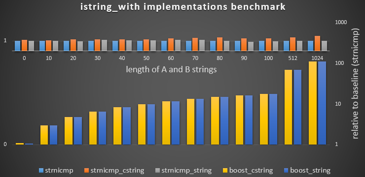
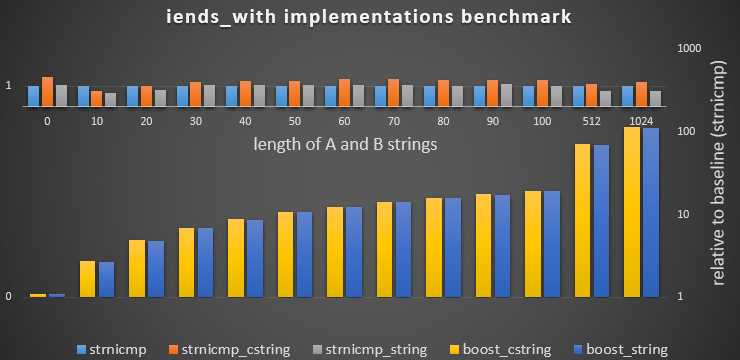

# string_benchmark

Simple non-academic performance comparison of various operations on C++ strings:
C strings, character arrays, `std::string` and `std::wstring` classes
as well as some of the Boost string algorithms.

The benchmarks use [Celero](https://github.com/DigitalInBlue/Celero) library.

The tests use [Catch](https://github.com/philsquared/Catch/).

## Build Status

| Branch | Travis CI | AppVeyor|
|:--- |:--- |:--- |
| `master` | [](https://travis-ci.org/mloskot/string_benchmark) | [](https://ci.appveyor.com/project/mloskot/string-benchmark/branch/master) |

## Results

See Travis CI and AppVeyor build logs.

### `istarts_with` with GCC 4.8.4



### `iends_with` with GCC 4.8.4



## Usage

Build and run the benchmark with:

### Unix

```
cmake -DCMAKE_BUILD_TYPE=Release /path/to/string_benchmark
make
```

### Windows

```
cmake -G "Visual Studio 2015" /path/to/string_benchmark
msbuild /p:Configuration=Release /p:Platform=Win32 string-benchmark.sln
```

## Credits

## Disclaimer

This project is driven by curiosity and for my own purposes.
This is not a rocket science, but a simple set of C++ programs,
with likelyhood of bugs, incorrectness or inconsistencies.
Found any, please report.
Comments and improvements are always welcome!